# 📖 Muse AI Clone — Comprehensive Codebase & Architecture Guide

Welcome to the comprehensive technical documentation for **Muse AI Clone** (and autonomous companion **Cooper**). This document provides an exhaustive, file-by-file breakdown of the entire architecture, explaining each component's responsibility, its dependencies, its interactions across the application, and detailed code snippets with inline documentation.

---

## 📑 Table of Contents

1. [Architectural Overview](#-architectural-overview)
2. [Codebase Tree & Directory Structure](#-codebase-tree--directory-structure)
3. [Exhaustive File-by-File Guide](#-exhaustive-file-by-file-guide)
   - [Root Configuration Files](#1-root-configuration-files)
   - [Routing & Navigation (`src/app/`)](#2-routing--navigation-srcapp)
   - [Screen Views (`src/screens/`)](#3-screen-views-srcscreens)
   - [Auth Components (`src/components/auth/`)](#4-auth-components-srccomponentsauth)
   - [Common Layout & Navigation (`src/components/common/`)](#5-common-layout--navigation-srccomponentscommon)
   - [Chat & Messaging (`src/components/chat/`)](#6-chat--messaging-srccomponentschat)
   - [Tab Views (`src/components/tabs/`)](#7-tab-views-srccomponentstabs)
   - [Constants & Mock Data (`src/constants/`)](#8-constants--mock-data-srcconstants)
4. [Component Hierarchy & Data Flow](#-component-hierarchy--data-flow)
5. [Design System & Color Tokens](#-design-system--color-tokens)
6. [Commands & Developer Workflow](#-commands--developer-workflow)

---

## 🏛️ Architectural Overview

**Muse AI Clone** is a Universal React Native application built with **Expo (SDK 57)** and **React Native 0.86.3**. It runs natively across iOS, Android, and Web browsers.

### Key Architectural Principles:
- **File-Based Routing:** Powered by `expo-router` using the `src/app/` directory structure.
- **Centralized Design Tokens:** All colors, spacing, and typography are defined in `src/constants/colors.ts` and `src/constants/theme.ts`. No hardcoded hex values in components.
- **Modular Component Architecture:** Split into domain-driven subdirectories (`auth`, `chat`, `common`, `tabs`).
- **Clean State Management:** React hooks (`useState`, `useEffect`, `useRef`) coordinate active tabs, conversation threads, agent customization, and modal layers.
- **Fluid Micro-Animations:** Native-driver animations (`react-native` Animated API) for thinking indicators and button feedback.

---

## 🌲 Codebase Tree & Directory Structure

```
muse_ai_clone/
├── AGENTS.md                          # Agent rules and project guidelines
├── CODEBASE_EXPLANATION.md            # Complete file-by-file codebase guide (this file)
├── README.md                          # Quick start and project overview
├── app.json                           # Expo app configuration & branding assets
├── package.json                       # Project dependencies & npm scripts
├── tsconfig.json                      # TypeScript compiler path aliases (@/*)
├── assets/                            # Static media and app icons
│   ├── expo.icon/                     # iOS App icon asset catalog
│   └── images/
│       ├── android-icon-*.png         # Android adaptive icon layers
│       ├── cooper_mascot.jpg          # 3D Cooper Mascot avatar portrait
│       ├── favicon.png                # Web browser favicon
│       ├── icon.png                   # Primary Expo application icon
│       └── splash-icon.png            # App launch splash screen emblem
└── src/
    ├── app/                           # Expo Router navigation routes
    │   ├── _layout.tsx                # Root layout, ThemeProvider, Stack navigator
    │   ├── index.tsx                  # Root entry route ('/' -> SignInScreen)
    │   └── home.tsx                   # Main app route ('/home' -> HomeScreen)
    ├── screens/                       # Composed top-level screens
    │   ├── SignInScreen.tsx           # Authentication screen with Google login
    │   └── HomeScreen.tsx             # Primary dashboard, tabs, and modal manager
    ├── components/                    # Modular reusable UI components
    │   ├── auth/                      # Authentication domain components
    │   │   ├── GoogleIcon.tsx         # Official 4-color SVG Google mark
    │   │   ├── MuseLogo.tsx           # Glowing AI spark emblem & wordmark
    │   │   ├── GoogleSignInButton.tsx # Elevated pressable Google OAuth button
    │   │   └── index.ts               # Auth barrel export
    │   ├── common/                    # Shared layout and navigation components
    │   │   ├── AppHeader.tsx          # 3-col header (Menu + Blue dot, 3D Mascot, 3-dots)
    │   │   ├── MascotAvatar.tsx       # 3D mascot photo & customizable vector fallback
    │   │   ├── TabNavigationBar.tsx   # Floating stadium dock (Chat, Feed, Ideas, Tasks, Settings)
    │   │   ├── SidebarDrawer.tsx      # Slide-in session history & search drawer
    │   │   ├── SettingsMenuModal.tsx  # 3-dots contextual action sheet dropdown
    │   │   ├── EditAgentModal.tsx     # Agent name, subtitle, icon, & aura color editor
    │   │   └── index.ts               # Common components barrel export
    │   ├── chat/                      # Chat domain components
    │   │   ├── ChatBubble.tsx         # Peach user bubble & soft gray agent bubble
    │   │   ├── ChatMessageList.tsx    # Scrollable history with date separator & auto-scroll
    │   │   ├── ChatInputBar.tsx       # Floating prompt input pill (+, Text, Mic/Send)
    │   │   ├── TypingIndicator.tsx    # Staggered 3-dot thinking pulse animation
    │   │   └── index.ts               # Chat components barrel export
    │   └── tabs/                      # Tab viewport views
    │       ├── FeedTab.tsx            # Real-time autonomous activity & notification feed
    │       ├── IdeasTab.tsx           # Pre-built prompt action templates
    │       ├── TasksTab.tsx           # Scheduled recurring goals & check-in triggers
    │       ├── SettingsTab.tsx        # Account limits, connectors, billing, and appearance
    │       └── index.ts               # Tabs barrel export
    └── constants/                     # Global constants & data models
        ├── colors.ts                  # Centralized color palette tokens
        ├── theme.ts                   # Typography and spacing scale constants
        └── dummyData.ts               # Data interfaces and mock seed datasets
```

---

## 🔍 Exhaustive File-by-File Guide

---

### 1. Root Configuration Files

#### [`package.json`](file:///Users/rahulsanarahulp/Documents/Projects/React%20Native/muse_ai_clone/package.json)
- **Role:** Declares project metadata, npm dependencies, and execution scripts.
- **Dependencies:**
  - `expo`: SDK 57 runtime.
  - `expo-router`: File-based routing.
  - `@hugeicons/react-native` & `@hugeicons/core-free-icons`: Clean outline icon library.
  - `react-native-svg`: Vector rendering for the Google brand icon.
  - `react-native-safe-area-context`: Notched device inset handling.
- **Scripts:**
  ```json
  "scripts": {
    "start": "expo start",       // Starts Metro bundler
    "android": "expo start --android",
    "ios": "expo start --ios",
    "web": "expo start --web",
    "lint": "expo lint"
  }
  ```

#### [`app.json`](file:///Users/rahulsanarahulp/Documents/Projects/React%20Native/muse_ai_clone/app.json)
- **Role:** Expo application manifest specifying app slug, icons, splash screens, scheme, and plugins.
- **Key Configuration:**
  - `scheme`: `"museaiclone"`
  - `userInterfaceStyle`: `"automatic"`
  - `plugins`: `["expo-router", "expo-splash-screen"]`
  - `experiments`: `typedRoutes: true`, `reactCompiler: true`

#### [`tsconfig.json`](file:///Users/rahulsanarahulp/Documents/Projects/React%20Native/muse_ai_clone/tsconfig.json)
- **Role:** TypeScript configuration specifying strict type safety and path aliases:
  - `@/*` -> `./src/*`
  - `@/assets/*` -> `./assets/*`

---

### 2. Routing & Navigation (`src/app/`)

#### [`src/app/_layout.tsx`](file:///Users/rahulsanarahulp/Documents/Projects/React%20Native/muse_ai_clone/src/app/_layout.tsx)
- **Role:** Root layout wrapping the entire application.
- **Responsibilities:**
  - Synchronizes color schemes with `ThemeProvider`.
  - Configures the top-level `Stack` navigator with seamless fade transitions and no default headers.
  - Sets the persistent dark `StatusBar`.
- **Code Snippet:**
  ```tsx
  /**
   * RootLayout Component
   * Synchronizes system theme and manages top-level Stack routing.
   */
  export default function RootLayout() {
    const colorScheme = useColorScheme();

    return (
      <ThemeProvider value={colorScheme === 'dark' ? DarkTheme : DefaultTheme}>
        <Stack screenOptions={{ headerShown: false, animation: 'fade' }}>
          <Stack.Screen name="index" options={{ headerShown: false }} />
          <Stack.Screen name="home" options={{ headerShown: false }} />
        </Stack>
        <StatusBar style="dark" />
      </ThemeProvider>
    );
  }
  ```

#### [`src/app/index.tsx`](file:///Users/rahulsanarahulp/Documents/Projects/React%20Native/muse_ai_clone/src/app/index.tsx)
- **Role:** Root entry route (`/`). Renders [`SignInScreen`](file:///Users/rahulsanarahulp/Documents/Projects/React%20Native/muse_ai_clone/src/screens/SignInScreen.tsx).

#### [`src/app/home.tsx`](file:///Users/rahulsanarahulp/Documents/Projects/React%20Native/muse_ai_clone/src/app/home.tsx)
- **Role:** Main home route (`/home`). Renders [`HomeScreen`](file:///Users/rahulsanarahulp/Documents/Projects/React%20Native/muse_ai_clone/src/screens/HomeScreen.tsx).

---

### 3. Screen Views (`src/screens/`)

#### [`src/screens/SignInScreen.tsx`](file:///Users/rahulsanarahulp/Documents/Projects/React%20Native/muse_ai_clone/src/screens/SignInScreen.tsx)
- **Role:** Clean onboarding screen providing brand introduction and one-tap Google authentication.
- **Exports:** `SignInScreen` (named and default).
- **Used By:** `src/app/index.tsx`.
- **Interactions:** Uses `useRouter()` from `expo-router` to replace route with `/home` upon successful sign-in.
- **Code Snippet:**
  ```tsx
  export const SignInScreen: React.FC = () => {
    const [loading, setLoading] = useState(false);
    const router = useRouter();

    // Handle Google OAuth authentication sequence
    const handleGoogleSignIn = () => {
      setLoading(true);
      setTimeout(() => {
        setLoading(false);
        router.replace('/home');
      }, 450);
    };

    return (
      <SafeAreaView style={styles.container} edges={['top', 'bottom', 'left', 'right']}>
        <View style={styles.content}>
          {/* Top / Center: Hero Logo and App Name */}
          <View style={styles.logoContainer}>
            <MuseLogo size="large" />
          </View>

          {/* Bottom / Action: Sign in with Google Button */}
          <View style={styles.actionContainer}>
            <GoogleSignInButton
              onPress={handleGoogleSignIn}
              loading={loading}
              text="Sign in with Google"
            />
          </View>
        </View>
      </SafeAreaView>
    );
  };
  ```

#### [`src/screens/HomeScreen.tsx`](file:///Users/rahulsanarahulp/Documents/Projects/React%20Native/muse_ai_clone/src/screens/HomeScreen.tsx)
- **Role:** Primary container screen coordinating all tabs, agent customization state, conversational message threads, and modal overlays.
- **Exports:** `HomeScreen` (named and default).
- **Used By:** `src/app/home.tsx`.
- **State Managed:**
  - `activeTab`: Currently selected tab (`'chat' | 'feed' | 'ideas' | 'tasks' | 'settings'`).
  - `agentName`, `agentSubtitle`, `mascotIcon`, `mascotColor`: Customizable agent persona.
  - `messages`: Active list of `ChatMessage` objects in conversation.
  - `isThinking`: Boolean indicating AI agent response generation.
  - `isSidebarOpen`, `isSettingsOpen`, `isEditAgentOpen`: Modal overlay visibilities.
- **Code Snippet:**
  ```tsx
  export const HomeScreen: React.FC = () => {
    const [activeTab, setActiveTab] = useState<TabKey>('chat');
    const [agentName, setAgentName] = useState('Cooper');
    const [messages, setMessages] = useState<ChatMessage[]>(INITIAL_CHAT_MESSAGES);
    const [isThinking, setIsThinking] = useState(false);

    // Send user message and simulate Cooper's intelligent response
    const handleSendMessage = (textToSend?: string) => {
      const prompt = (textToSend || inputText).trim();
      if (!prompt || isThinking) return;

      const newUserMsg: ChatMessage = {
        id: `msg-${Date.now()}`,
        sender: 'user',
        text: prompt,
        timestamp: new Date().toLocaleTimeString([], { hour: '2-digit', minute: '2-digit' }),
      };

      setMessages((prev) => [...prev, newUserMsg]);
      setInputText('');
      setIsThinking(true);

      setTimeout(() => {
        setIsThinking(false);
        setMessages((prev) => [
          ...prev,
          {
            id: `msg-${Date.now() + 1}`,
            sender: 'agent',
            text: "I've noted down your goal and can help you break it into simple daily milestones.",
            timestamp: new Date().toLocaleTimeString([], { hour: '2-digit', minute: '2-digit' }),
          },
        ]);
      }, 1000);
    };

    return (
      <SafeAreaView style={styles.safeArea} edges={['top', 'left', 'right']}>
        {/* Sticky App Header */}
        <AppHeader
          agentName={agentName}
          mascotIcon={mascotIcon}
          mascotColor={mascotColor}
          onOpenSidebar={() => setIsSidebarOpen(true)}
          onOpenSettings={() => setIsSettingsOpen(true)}
          onMascotPress={() => setIsEditAgentOpen(true)}
        />

        {/* Tab Viewport */}
        <KeyboardAvoidingView style={styles.mainContainer} behavior={Platform.OS === 'ios' ? 'padding' : undefined}>
          {activeTab === 'chat' && <ChatView />}
          {activeTab === 'feed' && <FeedTab />}
          {activeTab === 'ideas' && <IdeasTab onSelectIdea={(idea) => { setInputText(idea.prompt); setActiveTab('chat'); }} />}
          {activeTab === 'tasks' && <TasksTab />}
          {activeTab === 'settings' && <SettingsTab />}
        </KeyboardAvoidingView>

        {/* Floating Dock Navigation Bar */}
        <TabNavigationBar activeTab={activeTab} onSelectTab={setActiveTab} />
      </SafeAreaView>
    );
  };
  ```

---

### 4. Auth Components (`src/components/auth/`)

#### [`src/components/auth/GoogleIcon.tsx`](file:///Users/rahulsanarahulp/Documents/Projects/React%20Native/muse_ai_clone/src/components/auth/GoogleIcon.tsx)
- **Role:** Renders the authentic 4-color Google 'G' vector logo using SVG paths (Blue `#4285F4`, Green `#34A853`, Yellow `#FBBC05`, Red `#EA4335`), with optional monochrome fallback.
- **Props:** `size?: number`, `variant?: 'color' | 'monochrome'`, `color?: string`.

#### [`src/components/auth/MuseLogo.tsx`](file:///Users/rahulsanarahulp/Documents/Projects/React%20Native/muse_ai_clone/src/components/auth/MuseLogo.tsx)
- **Role:** Visual hero emblem featuring a soft glowing ambient halo ring, primary blue circle with `AiSparklesIcon`, and bold `Muse AI` typography.
- **Props:** `size?: 'small' | 'medium' | 'large'`, `showSubtitle?: boolean`.

#### [`src/components/auth/GoogleSignInButton.tsx`](file:///Users/rahulsanarahulp/Documents/Projects/React%20Native/muse_ai_clone/src/components/auth/GoogleSignInButton.tsx)
- **Role:** Pressable Google OAuth sign-in button with subtle elevation shadow, micro-scale press animation, and embedded loading spinner.
- **Props:** `onPress: () => void`, `loading?: boolean`, `disabled?: boolean`, `text?: string`.

#### [`src/components/auth/index.ts`](file:///Users/rahulsanarahulp/Documents/Projects/React%20Native/muse_ai_clone/src/components/auth/index.ts)
- **Role:** Barrel export for auth components.

---

### 5. Common Layout & Navigation (`src/components/common/`)

#### [`src/components/common/AppHeader.tsx`](file:///Users/rahulsanarahulp/Documents/Projects/React%20Native/muse_ai_clone/src/components/common/AppHeader.tsx)
- **Role:** Persistent top navigation bar.
- **Components Included:**
  - Left: Circular button with 2-line menu icon and active blue notification dot.
  - Center: 3D Mascot avatar portrait with floating white pill displaying the agent name.
  - Right: Circular button with horizontal 3-dots icon for settings dropdown.

#### [`src/components/common/MascotAvatar.tsx`](file:///Users/rahulsanarahulp/Documents/Projects/React%20Native/muse_ai_clone/src/components/common/MascotAvatar.tsx)
- **Role:** Renders either the high-resolution Cooper 3D character photo (`cooper_mascot.jpg`) or a customized vector emblem (Sparkle, Bot, Zap, Target, Brain) with user-selected aura colors.
- **Props:** `size?: 'small' | 'medium' | 'large' | 'header'`, `iconType?: string`, `customColor?: string`.

#### [`src/components/common/TabNavigationBar.tsx`](file:///Users/rahulsanarahulp/Documents/Projects/React%20Native/muse_ai_clone/src/components/common/TabNavigationBar.tsx)
- **Role:** Floating stadium-shaped dock capsule anchored at the bottom of the screen.
- **Features:** 5 tab items (Chat, Feed, Ideas, Tasks, Settings). Active tab receives a soft capsule pill background (`#E6E8EA`).

#### [`src/components/common/SidebarDrawer.tsx`](file:///Users/rahulsanarahulp/Documents/Projects/React%20Native/muse_ai_clone/src/components/common/SidebarDrawer.tsx)
- **Role:** Slide-in modal drawer for session history and side chats.
- **Features:**
  - "Main chat" quick-return capsule button.
  - Filterable "Side chats" list with unread blue indicator dots.
  - Bottom toolbar with settings shortcut, search input field, and new chat compose button.

#### [`src/components/common/SettingsMenuModal.tsx`](file:///Users/rahulsanarahulp/Documents/Projects/React%20Native/muse_ai_clone/src/components/common/SettingsMenuModal.tsx)
- **Role:** Minimalist dropdown action sheet anchored to top-right 3-dots header button.
- **Actions:** Edit Mascot & Avatar, Rename Agent, Export Chat, Clear Messages, Delete Chat (Destructive).

#### [`src/components/common/EditAgentModal.tsx`](file:///Users/rahulsanarahulp/Documents/Projects/React%20Native/muse_ai_clone/src/components/common/EditAgentModal.tsx)
- **Role:** Modal editor allowing full customization of agent persona:
  - Agent Name & Subtitle inputs.
  - 5 Mascot Emblem icon options (Sparkle AI, Autonomous Bot, Turbo Speed, Goal Sentinel, Deep Brain).
  - 6 Aura Theme colors (Muse Blue, Cyber Indigo, Emerald, Amber, Ultra Violet, Rose Red).
  - Live interactive preview card with immediate visual feedback.

#### [`src/components/common/index.ts`](file:///Users/rahulsanarahulp/Documents/Projects/React%20Native/muse_ai_clone/src/components/common/index.ts)
- **Role:** Barrel export for common layout and navigation components.

---

### 6. Chat & Messaging (`src/components/chat/`)

#### [`src/components/chat/ChatBubble.tsx`](file:///Users/rahulsanarahulp/Documents/Projects/React%20Native/muse_ai_clone/src/components/chat/ChatBubble.tsx)
- **Role:** Individual conversational message bubble.
- **Styling:**
  - User bubble: Warm peach terracotta background (`#E8C4B4`), right-aligned.
  - Agent bubble: Soft minimalist light gray (`#EEF0F2`), left-aligned.

#### [`src/components/chat/ChatMessageList.tsx`](file:///Users/rahulsanarahulp/Documents/Projects/React%20Native/muse_ai_clone/src/components/chat/ChatMessageList.tsx)
- **Role:** Scrollable conversation message thread.
- **Features:**
  - Centered date divider ("Sep 25 at 3:35 PM").
  - Auto-scrolls to latest message upon message arrival or typing state update.
  - Top flex spacer to push messages toward the bottom in initial short chats.

#### [`src/components/chat/ChatInputBar.tsx`](file:///Users/rahulsanarahulp/Documents/Projects/React%20Native/muse_ai_clone/src/components/chat/ChatInputBar.tsx)
- **Role:** Floating stadium-shaped prompt input bar.
- **Features:**
  - Left `+` button for attachments and tool integrations.
  - Text input with focus border highlighting and hardware/web Enter key submission.
  - Dynamic right button: Voice mic icon when input is empty; Up-arrow send button when user types.

#### [`src/components/chat/TypingIndicator.tsx`](file:///Users/rahulsanarahulp/Documents/Projects/React%20Native/muse_ai_clone/src/components/chat/TypingIndicator.tsx)
- **Role:** Hardware-accelerated 3-dot thinking pulse animation rendered inside an agent bubble while Cooper processes requests.
- **Code Snippet:**
  ```tsx
  export const TypingIndicator: React.FC = () => {
    const dot1 = useRef(new Animated.Value(0)).current;
    const dot2 = useRef(new Animated.Value(0)).current;
    const dot3 = useRef(new Animated.Value(0)).current;

    useEffect(() => {
      const animateDot = (anim: Animated.Value, delay: number) =>
        Animated.loop(
          Animated.sequence([
            Animated.delay(delay),
            Animated.timing(anim, { toValue: 1, duration: 350, useNativeDriver: true }),
            Animated.timing(anim, { toValue: 0, duration: 350, useNativeDriver: true }),
            Animated.delay(350),
          ])
        );

      const a1 = animateDot(dot1, 0);
      const a2 = animateDot(dot2, 180);
      const a3 = animateDot(dot3, 360);

      a1.start(); a2.start(); a3.start();
      return () => { a1.stop(); a2.stop(); a3.stop(); };
    }, [dot1, dot2, dot3]);

    return (
      <View style={styles.bubble}>
        <Animated.View style={[styles.dot, { transform: [{ translateY: dot1.interpolate({ inputRange: [0, 1], outputRange: [0, -5] }) }] }]} />
        <Animated.View style={[styles.dot, { transform: [{ translateY: dot2.interpolate({ inputRange: [0, 1], outputRange: [0, -5] }) }] }]} />
        <Animated.View style={[styles.dot, { transform: [{ translateY: dot3.interpolate({ inputRange: [0, 1], outputRange: [0, -5] }) }] }]} />
      </View>
    );
  };
  ```

#### [`src/components/chat/index.ts`](file:///Users/rahulsanarahulp/Documents/Projects/React%20Native/muse_ai_clone/src/components/chat/index.ts)
- **Role:** Barrel export for chat components and prop types.

---

### 7. Tab Views (`src/components/tabs/`)

#### [`src/components/tabs/FeedTab.tsx`](file:///Users/rahulsanarahulp/Documents/Projects/React%20Native/muse_ai_clone/src/components/tabs/FeedTab.tsx)
- **Role:** Clean autonomous activity feed viewport.

#### [`src/components/tabs/IdeasTab.tsx`](file:///Users/rahulsanarahulp/Documents/Projects/React%20Native/muse_ai_clone/src/components/tabs/IdeasTab.tsx)
- **Role:** Inspiration library presenting pre-configured AI builder templates with 3D domain icons (🏆, 🗂️, 📹, 🚀). Tapping any card automatically loads its detailed prompt into Cooper's chat and switches to the Chat tab.

#### [`src/components/tabs/TasksTab.tsx`](file:///Users/rahulsanarahulp/Documents/Projects/React%20Native/muse_ai_clone/src/components/tabs/TasksTab.tsx)
- **Role:** Autonomous task & goal manager.
- **Features:**
  - Scheduled routines with timing metadata (e.g. `Every day @ 8:00 AM`).
  - Active/Paused toggle switches.
  - Interactive "Run" manual execution simulation with real-time feedback badges ("Executed just now") and incrementing run counters.
  - "+ New" goal creation trigger.

#### [`src/components/tabs/SettingsTab.tsx`](file:///Users/rahulsanarahulp/Documents/Projects/React%20Native/muse_ai_clone/src/components/tabs/SettingsTab.tsx)
- **Role:** Comprehensive settings and integrations hub.
- **Features:**
  - **Free Plan Card:** Usage progress bar (11% used, 890 credits remaining), weekly limit reset timer, and "Upgrade" button.
  - **Connectors Sheet:** Manage 7 workspace tool integrations (Google Workspace, Notion, GitHub, Slack, Linear, Figma, X).
  - **Pricing Sheet:** Monthly / Yearly (Save 20%) billing toggle, Pro Plan features ($12-$15/mo), and Current Plan status.
  - **Notifications Sheet:** Toggle push notifications, 8:00 AM morning briefings, and task alerts.
  - **Appearance Sheet:** Choose System Default, Light, or Dark theme mode.
  - **Help & Feedback Sheet:** Documentation links, Discord community link, support contact, and version tag (`v2.4.0`).
  - **Sign Out:** Account sign out with confirmation modal.

#### [`src/components/tabs/index.ts`](file:///Users/rahulsanarahulp/Documents/Projects/React%20Native/muse_ai_clone/src/components/tabs/index.ts)
- **Role:** Barrel export for tab components.

---

### 8. Constants & Mock Data (`src/constants/`)

#### [`src/constants/colors.ts`](file:///Users/rahulsanarahulp/Documents/Projects/React%20Native/muse_ai_clone/src/constants/colors.ts)
- **Role:** Central source of truth for design tokens and color values.
- **Token Highlights:**
  - `Colors.primary` (`#2563EB`): Tech blue brand color.
  - `Colors.chatBubbleUser` (`#E8C4B4`): Peach terracotta user chat bubble.
  - `Colors.chatBubbleAi` (`#EEF0F2`): Soft light gray agent chat bubble.
  - `Colors.tabActiveBg` (`#E6E8EA`): Active dock tab capsule background.
  - `Colors.iconDark` (`#1E2022`): Dark charcoal for typography and active icons.
  - `Colors.iconMuted` (`#9E9E9E`): Secondary gray for timestamps and placeholders.

#### [`src/constants/theme.ts`](file:///Users/rahulsanarahulp/Documents/Projects/React%20Native/muse_ai_clone/src/constants/theme.ts)
- **Role:** Typography definitions (`Fonts`), standardized 8-point spacing scales (`Spacing`), and layout metrics (`BottomTabInset`, `MaxContentWidth`).

#### [`src/constants/dummyData.ts`](file:///Users/rahulsanarahulp/Documents/Projects/React%20Native/muse_ai_clone/src/constants/dummyData.ts)
- **Role:** TypeScript interfaces and seed datasets for:
  - `ChatMessage` & `INITIAL_CHAT_MESSAGES`
  - `SideChatItem` & `SIDE_CHATS`
  - `IdeaItem` & `IDEA_ITEMS`
  - `TaskGoalItem` & `TASK_GOALS`
  - `ConnectorItem` & `SETTINGS_CONNECTORS`
  - `SETTINGS_PLAN_DATA`

---

## 🔄 Component Hierarchy & Data Flow

```mermaid
graph TD
  RootLayout["src/app/_layout.tsx (ThemeProvider & Stack)"]
  
  SignInScreen["src/screens/SignInScreen.tsx"]
  HomeScreen["src/screens/HomeScreen.tsx"]
  
  RootLayout -->|Route: /| SignInScreen
  RootLayout -->|Route: /home| HomeScreen
  
  SignInScreen --> MuseLogo["components/auth/MuseLogo"]
  SignInScreen --> GoogleSignInButton["components/auth/GoogleSignInButton"]
  GoogleSignInButton --> GoogleIcon["components/auth/GoogleIcon"]
  
  HomeScreen --> AppHeader["components/common/AppHeader"]
  AppHeader --> MascotAvatar["components/common/MascotAvatar"]
  
  HomeScreen --> TabNavigationBar["components/common/TabNavigationBar"]
  HomeScreen --> SidebarDrawer["components/common/SidebarDrawer"]
  HomeScreen --> SettingsMenuModal["components/common/SettingsMenuModal"]
  HomeScreen --> EditAgentModal["components/common/EditAgentModal"]
  
  HomeScreen --> ChatMessageList["components/chat/ChatMessageList"]
  ChatMessageList --> ChatBubble["components/chat/ChatBubble"]
  ChatMessageList --> TypingIndicator["components/chat/TypingIndicator"]
  HomeScreen --> ChatInputBar["components/chat/ChatInputBar"]
  
  HomeScreen --> FeedTab["components/tabs/FeedTab"]
  HomeScreen --> IdeasTab["components/tabs/IdeasTab"]
  HomeScreen --> TasksTab["components/tabs/TasksTab"]
  HomeScreen --> SettingsTab["components/tabs/SettingsTab"]
```



---

## 🎨 Design System & Color Tokens

| Design Token | Hex / Value | Purpose |
|---|---|---|
| `Colors.primary` | `#2563EB` | Main brand blue |
| `Colors.primaryDark` | `#1D4ED8` | Pressed / hover active state |
| `Colors.chatBubbleUser` | `#E8C4B4` | Warm peach terracotta user bubble |
| `Colors.chatBubbleAi` | `#EEF0F2` | Soft light gray agent message bubble |
| `Colors.tabActiveBg` | `#E6E8EA` | Active tab pill capsule in dock |
| `Colors.iconDark` | `#1E2022` | Dark charcoal for icons and headings |
| `Colors.iconMuted` | `#9E9E9E` | Secondary gray for subtitles & timestamps |
| `Colors.statusBlue` | `#0066FF` | Online indicator dot on header drawer button |
| `Colors.white` | `#FFFFFF` | Main background & floating capsules |

---

## ⚡ Commands & Developer Workflow

```bash
# Start Metro development server
npm run start

# Run on iOS simulator
npm run ios

# Run on Android emulator
npm run android

# Run in Web browser
npm run web

# TypeScript type check (Zero errors guarantee)
npx tsc --noEmit
```
